# retracker Announcement Flow Diagram

This document contains a Mermaid diagram illustrating how retracker handles BitTorrent announcements and interacts with forwarders.

```mermaid
flowchart TD
    Start([BitTorrent Client HTTP Announce Request]) --> Parse[Parse Request: info_hash, peer_id, event, etc.]
    Parse --> EventCheck{Event Type?}
    
    %% Stopped Event Path
    EventCheck -->|stopped| StoppedPath[handleStoppedEvent]
    StoppedPath --> CancelJobs[Cancel Pending Jobs for this peer]
    CancelJobs --> ForwardStopped[Forward Stopped Event to All Forwarders - Parallel]
    ForwardStopped --> DeletePeer[Delete Peer from Local Storage]
    DeletePeer --> CheckLocal{Local Peers Remaining?}
    CheckLocal -->|No| CleanupForwarder[Cleanup ForwarderStorage for info_hash]
    CheckLocal -->|Yes| StoppedResponse[Return Response with interval]
    CleanupForwarder --> StoppedResponse
    StoppedResponse --> End1([Response to Client])
    
    %% Completed Event Path
    EventCheck -->|completed| CompletedPath[handleCompletedEvent]
    CompletedPath --> UpdateStorage1[Update Local Storage]
    UpdateStorage1 --> GetPeers1[Get Peers from Local + Forwarder Storage]
    GetPeers1 --> CalcInterval1[Calculate Interval from Forwarder Average]
    CalcInterval1 --> ForwardCompleted[Forward Completed Event to All Forwarders - Parallel]
    ForwardCompleted --> CacheRequest1[Cache Request]
    CacheRequest1 --> CheckReannounce1[Check and Re-announce if needed]
    CheckReannounce1 --> CompletedResponse[Return Response with peers + interval]
    CompletedResponse --> End2([Response to Client])
    
    %% Regular/Started Event Path
    EventCheck -->|started/empty| RegularPath[handleRegularAnnounce]
    RegularPath --> UpdateStorage2[Update Local Storage]
    UpdateStorage2 --> GetLocalPeers[Get Local Peers]
    GetLocalPeers --> FirstCheck{First Announce for info_hash?}
    
    %% First Announce Path
    FirstCheck -->|Yes| FirstAnnounce[handleFirstAnnounce]
    FirstAnnounce --> RateLimitCheck{Rate Limit Active?}
    RateLimitCheck -->|Yes & Exceeded| RateLimitReject[Reject: Return retry interval]
    RateLimitReject --> End3([Response to Client])
    RateLimitCheck -->|No| QueueFullCheck{Queue Full?}
    QueueFullCheck -->|Yes| QueueFullReject[Reject: Return retry interval]
    QueueFullReject --> End3
    QueueFullCheck -->|No| GetCachedPeers1[Get Cached Forwarder Peers - usually empty]
    GetCachedPeers1 --> CacheRequest2[Cache Request]
    CacheRequest2 --> QueueEligible[QueueEligibleAnnounces]
    QueueEligible --> ShouldAnnounce{ShouldAnnounceNow?}
    ShouldAnnounce -->|Yes| QueueJobs1[Queue Jobs Immediately to Worker Pool]
    ShouldAnnounce -->|No| SkipForwarder[Skip Forwarder - NextAnnounce not due]
    SkipForwarder --> QueueJobs1
    QueueJobs1 --> FirstResponse[Return Response - interval 15s]
    FirstResponse --> End3([Response to Client])
    
    %% Subsequent Announce Path
    FirstCheck -->|No| SubsequentAnnounce[handleSubsequentAnnounce]
    SubsequentAnnounce --> GetCachedPeers2[Get Cached Forwarder Peers]
    GetCachedPeers2 --> CalcInterval2[Calculate Interval from Forwarder Average]
    CalcInterval2 --> CacheRequest3[Cache Request]
    CacheRequest3 --> CheckReannounce2[Check and Re-announce - Compare Intervals]
    CheckReannounce2 --> IntervalCheck{Client Interval vs Forwarder Interval?}
    
    IntervalCheck -->|Client > Forwarder| ReannounceCheck{ShouldAnnounceNow?}
    IntervalCheck -->|Client < Forwarder| ReannounceCheck
    IntervalCheck -->|Equal| NoReannounce[No Re-announce Needed]
    
    ReannounceCheck -->|Yes| QueueJobs2[Queue Jobs to Worker Pool]
    ReannounceCheck -->|No| SkipReannounce[Skip - NextAnnounce not due]
    SkipReannounce --> SubsequentResponse[Return Response with peers + interval]
    NoReannounce --> SubsequentResponse
    QueueJobs2 --> SubsequentResponse
    SubsequentResponse --> End4([Response to Client])
    
    %% Forwarder Worker Pool Processing
    QueueJobs1 -.->|Job Queue| WorkerPool[Worker Pool - N workers]
    QueueJobs2 -.->|Job Queue| WorkerPool
    
    WorkerPool --> Worker[Worker Picks Job]
    Worker --> ExecuteAnnounce[executeAnnounce]
    ExecuteAnnounce --> ProtocolCheck{Forwarder Protocol?}
    
    ProtocolCheck -->|HTTP/HTTPS| BuildURI[Build HTTP URI with request params]
    ProtocolCheck -->|UDP| UDPConnect[Get or Refresh Connection ID]
    
    BuildURI --> HTTPRequest[HTTP GET Request to Forwarder with Timeout]
    UDPConnect --> UDPAnnounce[Send UDP Announce Packet - BEP 15 - with Retry]
    
    HTTPRequest --> HTTPResponseCheck{Response Status?}
    UDPAnnounce --> UDPResponseCheck{Response Valid?}
    
    HTTPResponseCheck -->|200 OK| ParseHTTPResponse[Parse Bencoded Response]
    HTTPResponseCheck -->|BEP 31 Retry| HandleRetry[handleRetryError: Schedule Retry]
    HTTPResponseCheck -->|Other Error| ErrorHandling[Log Error, Use Empty Peers, Interval 60s]
    
    UDPResponseCheck -->|Success| ParseUDPResponse[Parse Binary UDP Response, Extract Peers]
    UDPResponseCheck -->|Error| ErrorHandling
    
    HandleRetry --> RetryCheck{Retry < 10min?}
    RetryCheck -->|Yes| ScheduleRetry[Schedule Job for Retry Time]
    RetryCheck -->|No| DisableForwarder[Disable Forwarder - Retry too long]
    ScheduleRetry --> ScheduleMap2[Add to scheduledJobs Map]
    ScheduleMap2 --> SchedulerRoutine2[Scheduler Routine will move to queue when ready]
    SchedulerRoutine2 --> WorkerDone
    
    ParseHTTPResponse --> UpdateForwarderStorage[Update ForwarderStorage: Set NextAnnounce = now + interval]
    ParseUDPResponse --> UpdateForwarderStorage
    UpdateForwarderStorage --> RecordStats[Record Statistics: Response Time, Interval]
    RecordStats --> UnmarkJob[Unmark Job as Pending]
    DisableForwarder --> UnmarkJob
    ErrorHandling --> UnmarkJob
    UnmarkJob --> WorkerDone([Worker Ready for Next Job])
    
    %% Background Processes
    StoragePurge[Background Purge Routine - Every 1 Minute] --> CheckAge{Peer Age > Config.Age?}
    CheckAge -->|Yes| RemovePeer[Remove Stale Peer]
    CheckAge -->|No| KeepPeer[Keep Peer]
    RemovePeer --> CheckEmpty{Hash Empty?}
    CheckEmpty -->|Yes| RemoveHash[Remove Hash Entry]
    CheckEmpty -->|No| StoragePurge
    RemoveHash --> StoragePurge
    KeepPeer --> StoragePurge
    
    %% Styling
    classDef eventPath fill:#ffcccc,stroke:#ff0000,stroke-width:2px
    classDef storagePath fill:#ccffcc,stroke:#00ff00,stroke-width:2px
    classDef forwarderPath fill:#ccccff,stroke:#0000ff,stroke-width:2px
    classDef decision fill:#ffffcc,stroke:#ffaa00,stroke-width:2px
    
    class StoppedPath,CompletedPath,RegularPath eventPath
    class UpdateStorage1,UpdateStorage2,DeletePeer,StoragePurge storagePath
    class ForwardStopped,ForwardCompleted,TriggerInitial,ExecuteAnnounce,WorkerPool forwarderPath
    class EventCheck,FirstCheck,IntervalCheck,CheckAge decision
```

## Key Components

### 1. Event Handling
- **stopped**: Immediately forwards to all forwarders, cancels pending jobs, deletes peer
- **completed**: Forwards event, updates storage, continues normal flow (doesn't cancel jobs)
- **started/empty**: Normal announce flow with first/subsequent distinction

### 2. Storage Systems
- **Local Storage**: Thread-safe in-memory storage of peers (map[InfoHash]map[PeerID]Request)
- **ForwarderStorage**: Caches peers and intervals from forwarder responses
- **Background Purge**: Removes peers older than Config.Age (default 180 minutes)

### 3. Forwarder System
- **Protocol Support**: Automatically detects HTTP/HTTPS vs UDP from forwarder URI scheme
- **HTTP Forwarders**: Uses standard HTTP GET requests with query parameters
- **UDP Forwarders**: Uses BEP 15 UDP protocol with connection ID management
  - Connection IDs cached with 2-minute lifetime
  - Automatic connection ID refresh on expiration
  - Binary packet encoding/decoding
  - IPv4/IPv6 peer format detection
- **Worker Pool**: Parallel processing of forwarder requests (Config.ForwarderWorkers)
  - Base workers: Config.ForwarderWorkers
  - Max workers: Config.MaxForwarderWorkers
  - Auto-scaling based on queue fill percentage
- **Job Queue**: Buffered channel for announce jobs (Config.ForwarderQueueSize)
  - Immediate execution jobs go directly to queue
  - Scheduled jobs stored in scheduledJobs map until ready
- **Initial Announcements** (First announce for a hash):
  - **NOT scheduled** - queued immediately via `QueueEligibleAnnounces()`
  - Only queued if `ShouldAnnounceNow()` returns true (forwarder never seen hash OR NextAnnounce is due)
  - Rate limiting applied when queue fill >= threshold
  - Throttling: limits to top N forwarders when queue fill >= throttle threshold
- **Re-announcing Logic** (Subsequent announces):
  - Uses `QueueEligibleAnnounces()` with the same eligibility rules
  - Only queues when `ShouldAnnounceNow()` is true (NextAnnounce due or zero)
  - No forward scheduling; if not due, the forwarder is skipped
  - Jobs are deduplicated (pending job tracking prevents duplicates)
- **BEP 31 Retry Handling**:
  - When forwarder returns retry error, schedules retry at specified time
  - Only schedules if retry period < 10 minutes
  - If retry period >= 10 minutes, forwarder is disabled
- **Scheduler Routine**:
  - Runs every 5 seconds
  - Checks scheduledJobs map for jobs ready to execute
  - Moves ready jobs to jobQueue
  - If queue full, reschedules for 10 seconds later

### 4. Response Generation
- **First Announce**: Returns interval=15s, triggers initial forwarder announces
- **Subsequent Announces**: Returns average interval from forwarders, includes cached forwarder peers
- **Peer Aggregation**: Combines local peers + forwarder peers in response

## Flow Characteristics

1. **Non-blocking**: Forwarder operations don't block client responses
2. **Parallel Execution**: Stopped/completed events sent to all forwarders in parallel
3. **Deduplication**: Prevents duplicate jobs for same peer+forwarder+hash using pendingJobs map
4. **Interval Management**: Dynamically adjusts based on forwarder responses
   - Each forwarder maintains its own NextAnnounce time
   - Re-announcements respect forwarder's NextAnnounce to avoid rate limiting
5. **Error Handling**: Failed forwarder requests don't affect client response
6. **Scheduling vs Immediate Execution**:
   - **Initial announcements**: Always immediate (no scheduling)
   - **Re-announcements**: Immediate when due (via `QueueEligibleAnnounces`), skipped if not due
   - **Retry errors**: Scheduled at tracker-specified retry time
7. **Queue Management**:
   - Rate limiting: Applied to initial announcements when queue fill >= threshold
   - Throttling: Limits to top N forwarders when queue fill >= throttle threshold
   - Worker scaling: Auto-scales workers based on queue fill percentage
   - Queue full handling: Rejects new jobs or reschedules scheduled jobs
