# Announcement Logic

This document describes how retracker handles BitTorrent announcements, including event handling, forwarder queuing, rate limiting, and response generation.

## Flow Diagram

```mermaid
flowchart TD
    Start([BitTorrent Client HTTP Announce Request]) --> Parse[Parse Request: info_hash, peer_id, event, etc.]
    Parse --> EventCheck{Event Type?}
    
    %% Stopped Event Path
    EventCheck -->|stopped| StoppedPath[handleStoppedEvent]
    StoppedPath --> CancelJobs[Cancel Pending Jobs for this peer]
    CancelJobs --> ForwardStopped[Forward Stopped Event to All Forwarders - Parallel]
    ForwardStopped --> DeletePeer[Delete Peer from Local Storage]
    DeletePeer --> CheckLocal{Local Peers Remaining?}
    CheckLocal -->|No| CleanupForwarder[Cleanup ForwarderStorage for info_hash]
    CheckLocal -->|Yes| StoppedResponse[Return Response with interval]
    CleanupForwarder --> StoppedResponse
    StoppedResponse --> End1([Response to Client])
    
    %% Completed Event Path
    EventCheck -->|completed| CompletedPath[handleCompletedEvent]
    CompletedPath --> UpdateStorage1[Update Local Storage]
    UpdateStorage1 --> GetPeers1[Get Peers from Local + Forwarder Storage]
    GetPeers1 --> ForwardCompleted[Forward Completed Event to All Forwarders - Parallel]
    ForwardCompleted --> CompletedResponse[Return Response with peers + interval]
    CompletedResponse --> End2([Response to Client])
    
    %% Regular/Started Event Path
    EventCheck -->|started/empty| RegularPath[handleRegularAnnounce]
    RegularPath --> UpdateStorage2[Update Local Storage]
    UpdateStorage2 --> GetLocalPeers[Get Local Peers]
    GetLocalPeers --> FirstCheck{First Announce for info_hash?}
    
    %% First Announce Path
    FirstCheck -->|Yes| FirstAnnounce[handleFirstAnnounce]
    FirstAnnounce --> RateLimitCheck{Rate Limit Active?}
    RateLimitCheck -->|Yes & Exceeded| RateLimitReject[Reject: Return retry interval]
    RateLimitReject --> End3([Response to Client])
    RateLimitCheck -->|No| QueueFullCheck{Queue Full?}
    QueueFullCheck -->|Yes| QueueFullReject[Reject: Return retry interval]
    QueueFullReject --> End3
    QueueFullCheck -->|No| GetCachedPeers1[Get Cached Forwarder Peers - usually empty]
    GetCachedPeers1 --> QueueEligible[QueueEligibleAnnounces]
    QueueEligible --> ShouldAnnounce{ShouldAnnounceNow?}
    ShouldAnnounce -->|Yes| QueueJobs1[Queue Jobs Immediately to Worker Pool]
    ShouldAnnounce -->|No| SkipForwarder[Skip Forwarder - NextAnnounce not due]
    SkipForwarder --> QueueJobs1
    QueueJobs1 --> FirstResponse[Return Response - AnnounceInterval]
    FirstResponse --> End3([Response to Client])
    
    %% Subsequent Announce Path
    FirstCheck -->|No| SubsequentAnnounce[handleSubsequentAnnounce]
    SubsequentAnnounce --> GetCachedPeers2[Get Cached Forwarder Peers]
    GetCachedPeers2 --> ReannounceCheck{ShouldAnnounceNow?}
    
    ReannounceCheck -->|Yes| QueueJobs2[Queue Jobs to Worker Pool]
    ReannounceCheck -->|No| SkipReannounce[Skip - NextAnnounce not due]
    SkipReannounce --> SubsequentResponse[Return Response with peers + interval]
    QueueJobs2 --> SubsequentResponse
    SubsequentResponse --> End4([Response to Client])
    
    %% Forwarder Worker Pool Processing
    QueueJobs1 -.->|Job Queue| WorkerPool[Worker Pool - N workers]
    QueueJobs2 -.->|Job Queue| WorkerPool
    
    WorkerPool --> Worker[Worker Picks Job]
    Worker --> ExecuteAnnounce[executeAnnounce]
    ExecuteAnnounce --> ProtocolCheck{Forwarder Protocol?}
    
    ProtocolCheck -->|HTTP/HTTPS| BuildURI[Build HTTP URI with request params]
    ProtocolCheck -->|UDP| UDPConnect[Get or Refresh Connection ID]
    
    BuildURI --> HTTPRequest[HTTP GET Request to Forwarder with Timeout]
    UDPConnect --> UDPAnnounce[Send UDP Announce Packet - BEP 15 - with Retry]
    
    HTTPRequest --> HTTPResponseCheck{Response Status?}
    UDPAnnounce --> UDPResponseCheck{Response Valid?}
    
    HTTPResponseCheck -->|200 OK| ParseHTTPResponse[Parse Bencoded Response]
    HTTPResponseCheck -->|BEP 31 Retry| HandleRetry[handleRetryError: Schedule Retry]
    HTTPResponseCheck -->|Other Error| ErrorHandling[Log Error, Use Empty Peers, Interval 60s]
    
    UDPResponseCheck -->|Success| ParseUDPResponse[Parse Binary UDP Response, Extract Peers]
    UDPResponseCheck -->|Error| ErrorHandling
    
    HandleRetry --> RetryCheck{Retry < 10min?}
    RetryCheck -->|Yes| ScheduleRetry[Schedule Job for Retry Time]
    RetryCheck -->|No| DisableForwarder[Disable Forwarder - Retry too long]
    ScheduleRetry --> ScheduleMap2[Add to scheduledJobs Map]
    ScheduleMap2 --> SchedulerRoutine2[Scheduler Routine will move to queue when ready]
    SchedulerRoutine2 --> WorkerDone
    
    ParseHTTPResponse --> UpdateForwarderStorage[Update ForwarderStorage: Set NextAnnounce = now + interval]
    ParseUDPResponse --> UpdateForwarderStorage
    UpdateForwarderStorage --> RecordStats[Record Statistics: Response Time, Interval]
    RecordStats --> UnmarkJob[Unmark Job as Pending]
    DisableForwarder --> UnmarkJob
    ErrorHandling --> UnmarkJob
    UnmarkJob --> WorkerDone([Worker Ready for Next Job])
    
    %% Background Processes
    StoragePurge[Background Purge Routine - Every 1 Minute] --> CheckAge{Peer Age > Config.Age?}
    CheckAge -->|Yes| RemovePeer[Remove Stale Peer]
    CheckAge -->|No| KeepPeer[Keep Peer]
    RemovePeer --> CheckEmpty{Hash Empty?}
    CheckEmpty -->|Yes| RemoveHash[Remove Hash Entry]
    CheckEmpty -->|No| StoragePurge
    RemoveHash --> StoragePurge
    KeepPeer --> StoragePurge
    
    %% Styling
    classDef eventPath fill:#ffcccc,stroke:#ff0000,stroke-width:2px
    classDef storagePath fill:#ccffcc,stroke:#00ff00,stroke-width:2px
    classDef forwarderPath fill:#ccccff,stroke:#0000ff,stroke-width:2px
    classDef decision fill:#ffffcc,stroke:#ffaa00,stroke-width:2px
    
    class StoppedPath,CompletedPath,RegularPath eventPath
    class UpdateStorage1,UpdateStorage2,DeletePeer,StoragePurge storagePath
    class ForwardStopped,ForwardCompleted,TriggerInitial,ExecuteAnnounce,WorkerPool forwarderPath
    class EventCheck,FirstCheck,ReannounceCheck,CheckAge decision
```

## Configuration

| Setting | YAML key | Default |
|---------|----------|---------|
| Queue size | `forwarder_queue_size` | 10000 |
| Base workers | `forwarder_workers` | 10 |
| Max workers | `max_forwarder_workers` | 20 |
| Scale threshold (% full) | `queue_scale_threshold_pct` | 60 |
| Throttle threshold (% full) | `queue_throttle_threshold` | 60 |
| Throttle top-N forwarders | `queue_throttle_top_n` | 20 |
| Rate-limit threshold (% full) | `queue_rate_limit_threshold` | 80 (0 to disable) |
| Rate-limit tokens/sec | `rate_limit_initial_per_sec` | 10 |
| Rate-limit burst | `rate_limit_initial_burst` | 200 |
| Forwarder suspend seconds | `forwarder_suspend_seconds` | 300 |
| Max forwarders per announce | `max_forwarders_per_announce` | 100 |
| Retry period (rate-limit response) | `retry_period` | 300 |

## Event Handling

- **stopped**: Cancels pending jobs, forwards to all forwarders in parallel, deletes peer from local storage
- **completed**: Updates storage, forwards event, continues normal flow
- **started/empty**: Normal announce flow with first/subsequent distinction

## Announce Flow

### Job Types

**Initial Announcements** (`QueueEligibleAnnounces`):
- First time a forwarder sees a hash
- Queued immediately (not scheduled)
- `ShouldAnnounceNow()` checks if forwarder has never seen hash or NextAnnounce is due

**Re-announcements** (`QueueEligibleAnnounces`):
- Same code path as initial announces
- `ShouldAnnounceNow()` must return true (NextAnnounce due)
- If not due → forwarder is skipped (no job created)

**Retry Jobs** (BEP 31):
- Created by `handleRetryError()` when forwarder requests retry
- Always scheduled at tracker-specified time
- If `retry_in >= 10 minutes` → no retry, treat as completed
- If `retry_in == "never"` → disable forwarder

### Eligibility Check (`ShouldAnnounceNow`)

Returns `true` if:
- Forwarder has never seen this hash, OR
- `NextAnnounce` is zero or in the past

Returns `false` if:
- `NextAnnounce` is in the future → skip forwarder

### Queue Flow

1. Incoming announces call `QueueEligibleAnnounces()`
2. Forwarders are shuffled randomly for load distribution
3. Each forwarder checked: disabled? suspended? `ShouldAnnounceNow()`?
4. Eligible jobs queued (up to limits)
5. Workers execute jobs and update `NextAnnounce` per forwarder

## Rate Limiting (Initial Announces Only)

Protects the system during high load by rejecting initial announces early.

**When triggered** (both conditions):
1. Queue fill >= `queue_rate_limit_threshold` (default 80%)
2. Token bucket has no tokens

**Token bucket algorithm**:
- Starts with `rate_limit_initial_burst` tokens (default 200)
- Refills at `rate_limit_initial_per_sec` tokens/second (default 10)
- Each allowed announce consumes 1 token

**What happens**:
- Client receives: "tracker busy, retry in X seconds"
- Announce NOT queued to any forwarder
- `rate_limited` counter increments

**Disabling**: Set `queue_rate_limit_threshold: 0`

## Throttling

Limits forwarders per announce when queue is filling up.

**When triggered**:
- Queue fill >= `queue_throttle_threshold` (default 60%)
- `queue_throttle_top_n` > 0 (default 20)

**Behavior**:
- Limits to `queue_throttle_top_n` forwarders
- Forwarders shuffled randomly before selection
- Distributes load evenly across forwarders

## Max Forwarders Per Announce

**Config**: `max_forwarders_per_announce` (default: 100)

- Limits forwarders even when not throttling
- When throttling: uses `min(max_forwarders_per_announce, queue_throttle_top_n)`
- Random shuffle ensures fair distribution

## Queue Full Handling

| Situation | Behavior |
|-----------|----------|
| Initial announce | Client receives: "tracker queue full, retry in 30 minutes" |
| Re-announcement | Job dropped silently, `dropped_full` counter increments |
| Scheduled job | Rescheduled for +10 seconds, no job loss |

## Forwarder Execution

### Protocol Support

- **HTTP/HTTPS**: Standard HTTP GET requests with query parameters
- **UDP**: BEP 15 protocol with connection ID management
  - Connection IDs cached with 2-minute lifetime
  - Automatic refresh on expiration
  - Binary packet encoding/decoding

### Retries

**HTTP**:
- Uses `ForwarderRetryAttempts` with exponential backoff
- Base delay: `ForwarderRetryBaseMs`, Timeout: `ForwardTimeout`
- Non-retryable errors disable forwarder
- HTTP 429 triggers suspension instead

**UDP**:
- Same retry config as HTTP

**Retryable errors** (will retry up to configured attempts):
- Request timeout
- HTTP 5xx (server errors)
- Temporary network issues

**Non-retryable errors** (disables forwarder immediately):
- DNS errors: `no such host`, `unknown host`
- Connection refused (port not open)
- `no route to host`, `network is unreachable`
- HTTP 400/403/404 (tracker rejection)

### Forwarder Suspension

**Trigger**: HTTP 429 or overload signals via `shouldSuspendForwarder()`

**Behavior**:
- Suspended for `forwarder_suspend_seconds` (default 300)
- Skipped for new announces until expiration

## Storage Systems

- **Local Storage**: Thread-safe in-memory peers (`map[InfoHash]map[PeerID]Request`)
- **ForwarderStorage**: Caches peers and intervals from forwarder responses
- **Background Purge**: Removes peers older than `Config.Age` (default 180 minutes)

## Response Generation

- **First Announce**: Returns `Config.AnnounceInterval` (default 30 min)
- **Subsequent Announces**: Returns `Config.AnnounceInterval`, includes cached forwarder peers
- **Peer Aggregation** (`getPeersForResponse`):
  - Seeders: Local peers with `left=0` or `event=completed`, plus forwarder peers
  - Leechers: Local peers with `left>0` and not completed
  - IP deduplication: Same IP counted only once

## Flow Characteristics

1. **Non-blocking**: Forwarder operations don't block client responses
2. **Parallel Execution**: Stopped/completed events sent to all forwarders in parallel
3. **Deduplication**: Prevents duplicate jobs via `pendingJobs` map
4. **Interval Management**: Each forwarder maintains its own `NextAnnounce` per info_hash
5. **Error Handling**: Failed forwarder requests don't affect client response

## Metrics & Stats

**Endpoints**: `/stats` (text & JSON), `/metrics` (Prometheus)

**Queue metrics**: `queue_depth`, `queue_capacity`, `queue_fill_pct`, `queue_dropped_full`, `queue_rate_limited`, `queue_throttled_forwarders`

**Worker metrics**: `forwarder_workers` (current count)

## Tests

`internal/server/forwarderManager_test.go`:
- Rate-limit threshold disabled/active
- Throttle limits forwarder count
- Max forwarders per announce limit
- Skip recently announced forwarders
- Suspension expiration

`internal/server/forwarderAnnounce_test.go`:
- Announce result handling
- Job pending/cancellation logic
- Suspension trigger conditions

